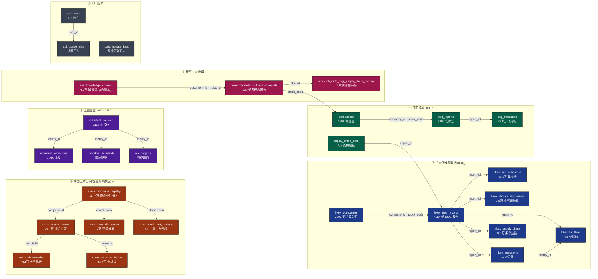

# ESG 数据库（esg_db）表关系图

PostgreSQL 15.15，`public` schema 共 32 张表（本图含 28 张，排除 5 张 `hkex_climate_disclosure_backup_*` 备份表）。表间无显式外键，连线为按共享键（`stock_code / report_id / credit_code / facility_id / permit_id / doc_id` 等）推断的逻辑关系。

