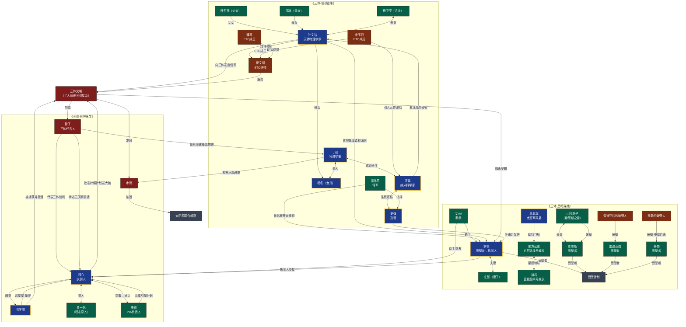

# 《三体》人物关系图

按小说三部曲分块，标注主要人物关系、阵营与关键事件。

```mermaid
flowchart TD
    classDef tri fill:#7f1d1d,color:#fff,stroke:#000
    classDef eto fill:#7c2d12,color:#fff,stroke:#000
    classDef human fill:#065f46,color:#fff,stroke:#000
    classDef core fill:#1e3a8a,color:#fff,stroke:#fbbf24,stroke-width:2px
    classDef obj fill:#374151,color:#fff,stroke:#000

    subgraph B1[《三体·地球往事》]
        YWJ["叶文洁<br/>天体物理学家"]
        YZT["叶哲泰（父亲）"]
        SL["邵琳（母亲）"]
        YWN["杨卫宁（丈夫）"]
        YD["杨冬（女儿）"]
        DY["丁仪<br/>物理学家"]
        WM["汪淼<br/>纳米科学家"]
        SQ["史强<br/>刑警"]
        CWS["常伟思<br/>将军"]
        SYF["申玉菲<br/>ETO成员"]
        PH["潘寒<br/>ETO成员"]
        EV["伊文斯<br/>ETO统帅"]

        YZT -->|父女| YWJ
        SL -->|母女| YWJ
        YWN <-->|夫妻| YWJ
        YWJ -->|母女| YD
        DY <-->|恋人| YD
        DY <-->|试验伙伴| WM
        WM <-->|生死搭档| SQ
        CWS -->|指挥| SQ
        YWJ -->|精神领袖| EV
        SYF -->|ETO成员| EV
        PH -->|ETO成员| EV
        SYF -->|引入三体游戏| WM
        WM -->|发现红岸秘密| YWJ
    end

    subgraph B2[《三体·黑暗森林》]
        LJ["罗辑<br/>面壁者→执剑人"]
        ZY["庄颜（妻子）"]
        AA["艾AA<br/>助手"]
        ZBH["章北海<br/>太空军政委"]
        DFYX["东方延绪<br/>自然选择号舰长"]
        CY["褚岩<br/>蓝色空间号舰长"]
        HS["希恩斯<br/>面壁者"]
        SHHZ["山杉惠子<br/>（希恩斯之妻）"]
        LDDZ["雷迪亚兹<br/>面壁者"]
        TL["泰勒<br/>面壁者"]
        PBR_TL["泰勒的破壁人"]
        PBR_LD["雷迪亚兹的破壁人"]
        MBP["面壁计划"]

        LJ <-->|夫妻| ZY
        AA -->|助手| LJ
        ZBH -->|劫持飞船| DFYX
        DFYX <-->|星舰地球| CY
        CWS -->|传达面壁者身份| LJ
        LJ -->|面壁者| MBP
        HS -->|面壁者| MBP
        LDDZ -->|面壁者| MBP
        TL -->|面壁者| MBP
        SHHZ <-->|夫妻| HS
        SHHZ -->|破壁| HS
        PBR_TL -->|破壁·泰勒自杀| TL
        PBR_LD -->|破壁| LDDZ
    end

    subgraph B3[《三体·死神永生》]
        CX["程心<br/>执剑人"]
        YTM["云天明"]
        SOPHON["智子<br/>三体代言人"]
        GYF["关一帆<br/>（程心恋人）"]
        WD["维德<br/>PIA负责人"]
        DROP["水滴"]

        CX -->|暗恋| YTM
        YTM -->|送星星·挚爱| CX
        CX <-->|恋人| GYF
        CX <-->|同事→对立| WD
        SOPHON -->|代表三体谈判| CX
        AA -->|助手/挚友| CX
        WD -->|曲率引擎计划| CX
    end

    TRI["三体文明<br/>（半人马座三体星系）"]
    SOL_FLEET["太阳系联合舰队"]

    YWJ -->|向三体发出信号| TRI
    YWJ -->|传授黑暗森林法则| LJ
    EV -->|服务| TRI
    TRI -->|制造| SOPHON
    TRI -->|发射| DROP
    TRI -->|暗杀罗辑| LJ
    SOPHON -->|锁死地球基础物理| DY
    DY -->|考察水滴遇难| DROP
    DROP -->|摧毁| SOL_FLEET
    SQ -->|冬眠后保护| LJ
    LJ -->|执剑人交接| CX
    SOPHON -->|转述云天明童话| CX
    CX -->|批准针眼计划送大脑| TRI
    YTM -->|被捕获并复活| TRI

    class YWJ,YD,DY,WM,LJ,ZBH,CX,YTM,SQ core
    class TRI,SOPHON,DROP tri
    class EV,SYF,PH,PBR_TL,PBR_LD eto
    class ZY,AA,CWS,DFYX,CY,GYF,WD,YZT,SL,YWN,SHHZ,HS,LDDZ,TL human
    class MBP,SOL_FLEET obj
```
