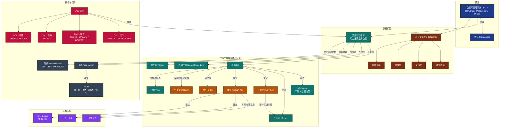

# 数据库主要概念关系图

按「数据模型 → 核心对象 → 表间关系 → 操作与保障」的层次梳理关系型数据库的主要概念。

```mermaid
flowchart TD
    classDef db fill:#1e3a8a,color:#fff,stroke:#000
    classDef obj fill:#0f766e,color:#fff,stroke:#000
    classDef key fill:#b45309,color:#fff,stroke:#000
    classDef nosql fill:#7c2d12,color:#fff,stroke:#000
    classDef rel fill:#7c3aed,color:#fff,stroke:#000
    classDef sql fill:#be123c,color:#fff,stroke:#000
    classDef safety fill:#334155,color:#fff,stroke:#000

    subgraph G0[顶层]
        DB["数据库 Database"]
        DBMS["数据库管理系统 DBMS<br/>如 MySQL、PostgreSQL、Oracle"]
    end

    subgraph G1[数据模型]
        RDB["关系型数据库<br/>用二维表组织数据"]
        NOSQL["非关系型数据库 NoSQL"]
        KV["键值存储"]
        DOC["文档型"]
        CF["列族型"]
        GR["图数据库"]
    end

    subgraph G2[关系型数据库核心对象]
        TBL["表 Table"]
        COL["列 Column<br/>字段 + 数据类型"]
        ROW["行 Row（记录）"]
        PK["主键 Primary Key"]
        FK["外键 Foreign Key"]
        IDX["索引 Index"]
        CONS["约束 Constraint"]
        VIEW["视图 View"]
        SP["存储过程 Stored Procedure"]
        TRIG["触发器 Trigger"]
    end

    subgraph G3[表间关系]
        R11["一对一 1:1"]
        R1N["一对多 1:N"]
        RMN["多对多 M:N<br/>需中间表"]
    end

    subgraph G4[操作与保障]
        SQL["SQL 语言"]
        DDL["DDL · 定义<br/>CREATE / DROP / ALTER"]
        DML["DML · 操作<br/>INSERT / UPDATE / DELETE"]
        DQL["DQL · 查询<br/>SELECT"]
        DCL["DCL · 权限<br/>GRANT / REVOKE"]
        TX["事务 Transaction"]
        ACID["ACID<br/>原子性·一致性·隔离性·持久性"]
        NORM["范式 Normalization<br/>1NF / 2NF / 3NF / BCNF"]
    end

    DBMS -->|管理| DB
    DBMS --> RDB
    DBMS --> NOSQL
    NOSQL --> KV
    NOSQL --> DOC
    NOSQL --> CF
    NOSQL --> GR
    RDB -->|核心是| TBL
    TBL -->|组成| COL
    TBL -->|组成| ROW
    TBL -->|定义| PK
    TBL -->|定义| FK
    TBL -->|可建立| IDX
    TBL -->|保证数据完整性| CONS
    TBL -->|派生虚拟表| VIEW
    RDB -->|可包含| SP
    RDB -->|可包含| TRIG
    PK -->|唯一标识每行| ROW
    FK -->|引用他表主键| R1N
    FK -->|建立| R11
    FK -->|建立| RMN
    SQL -->|操作| RDB
    SQL --> DDL
    SQL --> DML
    SQL --> DQL
    SQL --> DCL
    RDB -->|事务保证| TX
    TX -->|遵循| ACID
    RDB -->|设计时规范化| NORM

    class DB,DBMS db
    class RDB,TBL,COL,ROW,VIEW,SP,TRIG obj
    class PK,FK,IDX,CONS key
    class NOSQL,KV,DOC,CF,GR nosql
    class R11,R1N,RMN rel
    class SQL,DDL,DML,DQL,DCL sql
    class TX,ACID,NORM safety
```
